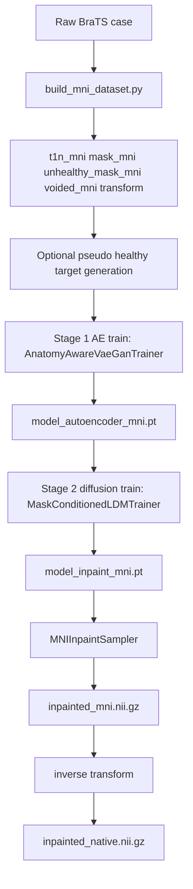

# MNI-Based BraTS Inpainting Pipeline Plan (Current)

## Goal

Maintain a practical, training-ready MNI pipeline that:

1. builds or reuses aligned MNI cache data,
2. trains Stage 1 autoencoder with optional frozen segmentation teacher,
3. trains Stage 2 mask-conditioned diffusion with strong latent conditioning,
4. performs MNI inpainting and maps results back to native space.

## Current End-to-End Flow

## Stage 0: Data and MNI Cache

### Implemented in scripts/build_mni_dataset.py

Two supported modes:

1. Standard mode
- input: raw data folders + template path + output dir
- does registration and writes MNI cache per case

2. Fill-only mode
- input: existing aligned cache via --aligned_cache_dir
- does not re-register; only creates pseudo-healthy targets

Per-case cache outputs currently used:

- t1n_mni.nii.gz
- mask_mni.nii.gz
- unhealthy_mask_mni.nii.gz (preferred when present)
- healthy_mask_mni.nii.gz (optional)
- t1n_voided_mni.nii.gz
- t1n_pseudo_healthy_mni.nii.gz (optional)
- mri_to_mni_transform.tfm
- metadata.json

## Stage 1: Autoencoder Training (Anatomy-Aware)

### Config

- configs/train_autoencoder_mni.json

### Current training objective

Autoencoder + PatchGAN with optional anatomy supervision from frozen MONAI segmentation teacher.

Trainer:

- scripts/ldm_trainer.py: AnatomyAwareVaeGanTrainer

Seg guidance behavior:

- uses scripts/losses.py anatomical_segmentation_loss,
- supports wm/gm class index selection,
- supports sparse execution via seg_every_n_steps.

### Current low-VRAM settings (active)

- train_batch_size: 1
- train_patch_size: [96, 128, 96]
- d_train_steps: 1
- lambda_seg: 0.01
- seg_every_n_steps: 4

These are applied to reduce OOM risk on ~16 GB GPU.

### Seg teacher loading

- scripts/seg_teacher.py

Supports:

1. bundle download + extraction when URL is provided,
2. fallback download/extract when monai.apps helpers are unavailable,
3. nested-folder bundle resolution,
4. frozen eval-only segmentor.

## Stage 2: Mask-Conditioned Diffusion Training

### Config

- configs/train_diffusion_inpaint_mni.json

### Current conditioning mode (active)

Unified single MNI inpainting model with strong mask conditioning.

- z_noisy + mask_latent + z_voided
- region metadata is available per case, but the active training path uses all regions together; no separate per-region diffusion models are trained.
- mask augmentation is now deformation-based on the original lesion mask, not synthetic box/sphere mask replacement.

Implementation:

- scripts/mask_conditioned_ldm_trainer.py
- concat_voided_latent: true
- concat_atlas_latent: false
- diffusion in_channels: 17

### Region-specific mask training strategy

To make the inpainting model more specialized, we train separate region-aware variants of the mask-conditioned diffusion model:

- Deep model:
  - focuses on lesions or missing regions located in deeper brain structures.
  - useful when the corruption is near the center of the brain, around deep gray matter, or in anatomically interior areas.
  - helps the model learn to restore content that is more spatially constrained and less visible from the cortical boundary.

- Cortical model:
  - focuses on masks near the cortical surface and outer tissue layers.
  - suitable for superficial lesions, boundary irregularities, and regions close to the brain cortex.
  - encourages the model to recover fine-grained surface anatomy and local texture.

- Center model:
  - focuses on masks placed around the central / midline portion of the brain.
  - useful for central lesions, symmetric midline pathology, and structures near the ventricular or central anatomical axis.
  - emphasizes global consistency for centrally located inpainting.

### Custom mask augmentation method

In addition to the original lesion mask, we add synthetic masks to improve robustness and encourage the model to learn from diverse missing-region patterns.

The current approach is:

1. Start from the real lesion mask when available.
2. Generate additional synthetic masks using several 3D geometric shapes:
   - lesion-like mask,
   - sphere,
   - box,
   - blob.
3. Place the synthetic mask into a target region according to the model type:
   - Deep -> deep/internal region,
   - Cortical -> cortical/superficial region,
   - Center -> central/midline region.
4. Apply random translation, scaling, and deformation to make the augmented masks look more natural and less artificial.
5. Normalize the mask to the appropriate latent spatial size before feeding it into the diffusion conditioning path.

This strategy makes the training data more diverse while still preserving anatomical relevance. In practice, the model learns not only from the real lesion pattern, but also from a wider range of plausible inpainting masks that are placed in the same anatomical context as the target region.

### Current anatomy guidance in Stage 2

Periodic seg guidance is enabled and computed every fseg iterations:

- seg_guidance_weight: 0.02
- fseg: 20
- seg_denoise_steps: 10

Mechanism:

1. run a short denoise rollout from current noisy latent,
2. decode to image,
3. apply segmentation consistency loss against real image,
4. add weighted guidance to diffusion noise loss.

## Inference Pipeline (Current)

### Config

- configs/inference_inpaint_mni.json

### Sampler

- scripts/mni_inpaint_sampler.py

Current sampler behavior:

1. load case image/mask/voided/(atlas),
2. encode voided image as known latent,
3. sample latent with mask-preserving update each DDIM step,
4. decode latent,
5. compose final image: outside-mask from voided, inside-mask from generated,
6. save MNI output,
7. inverse-transform to native space when transform metadata exists.

Notes:

- Inference routes each case to a region-specific checkpoint: `model_inpaint_mni_deep.pt`, `model_inpaint_mni_cortical.pt`, `model_inpaint_mni_center.pt`.
- If the requested region checkpoint is missing, inference now stops with an error instead of falling back to a unified checkpoint.

Outputs per case:

- inpainted_mni.nii.gz
- inpainted_native.nii.gz (if transform + original reference are available)

## Current File Roles

- scripts/register_to_mni.py: estimate MRI to MNI transform
- scripts/apply_mni_transform.py: apply transform (mask uses nearest interpolation)
- scripts/build_mni_dataset.py: build cache, fill-only mode, pseudo-healthy generation
- scripts/mni_transforms.py: case collection and transform builders; supports atlas + pseudo-healthy preference
- scripts/ldm_trainer.py: Stage 1 AE/GAN trainer with optional sparse seg supervision
- scripts/mask_conditioned_ldm_trainer.py: Stage 2 conditional latent diffusion trainer
- scripts/mni_inpaint_sampler.py: MNI sampling + optional inverse transform
- scripts/seg_teacher.py: MONAI bundle segmentor loader (with compatibility fallback)

## Operational Commands

### Build full MNI cache

python scripts/build_mni_dataset.py --data_dir <raw_data_dir> --template_path ./MNI152_T1_1mm_brain.nii.gz --output_dir ./data/mni_cache --overwrite

### Fill pseudo-healthy only (already aligned cache)

python scripts/build_mni_dataset.py --aligned_cache_dir ./data/mni_cache --template_path ./MNI152_T1_1mm_brain.nii.gz --overwrite

### Stage 1 train (AE)

python -m monai.bundle run --config_file configs/train_autoencoder_mni.json

### Stage 2 train (diffusion inpaint)

python -m monai.bundle run --config_file configs/train_diffusion_inpaint_mni.json

### Inference

python -m monai.bundle run --config_file configs/inference_inpaint_mni.json

## Current Status and Next Focus

Implemented and wired:

1. MNI cache pipeline and fill-only mode,
2. strong latent conditioning with atlas prior,
3. Stage 1 and Stage 2 segmentation-teacher guidance,
4. compatibility fallback for teacher bundle extraction.

Current blocker:

- Stage 1 OOM sensitivity on limited VRAM; low-VRAM settings are now active and should be validated with a fresh run.

If OOM persists, next fallback order:

1. reduce train_patch_size further,
2. temporarily set lambda_seg to 0 for Stage 1 stabilization,
3. restore segmentation guidance after AE checkpoint is stable.

